  

  

<!-- बाकी README नीचे -->
<!-- ===================================================== -->
<!--             PREMIUM PROFILE DASHBOARD                 -->
<!-- ===================================================== -->

<h2 align="center">💠 Profile Dashboard</h2>

| 🛡️ Profile | 📌 Information |
|------------|----------------|
| 👤 Username | **DarkLight000999** |
| 💻 Role | **Cyber Security Professional** |
| 🎯 Specialization | **Ethical Hacking & Security Research** |
| 🌍 Country | **India 🇮🇳** |
| 🐧 Operating System | **Linux** |
| ⚡ Programming | **Python • Bash • JavaScript** |
| 🎓 Currently Learning | **Advanced Penetration Testing** |
| 🔥 Status | **Always Building • Always Learning** |

<!-- ===================================================== -->
<!--               TECH STACK & SKILLS                      -->
<!-- ===================================================== -->

<h2 align="center">⚡ Tech Stack & Skills</h2>

  

---

# 💻 Security Focus

| Domain | Status |
|---------|--------|
| 🌐 Web Application Security | ████████████░ |
| 🔍 OSINT | ███████████░░ |
| 🐧 Linux | █████████████ |
| 🐍 Python Automation | ███████████░░ |
| 🔐 Cyber Security | █████████████ |
| ⚔️ Ethical Hacking | ████████████░ |

---

